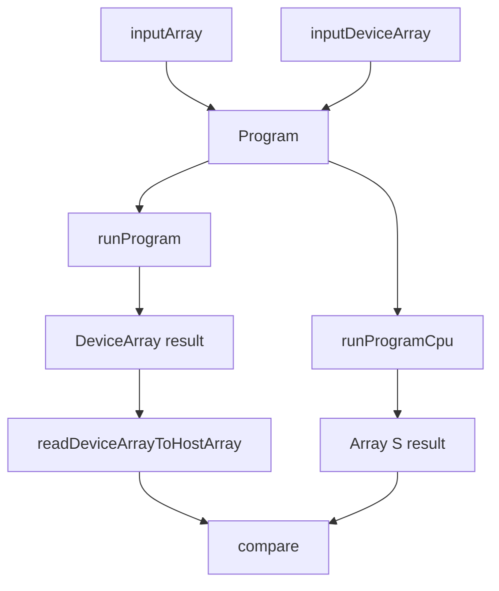

# Molten CPU Reference Evaluator Design

> Design Log #4

## Background

`molten` 现在已经不只是一个底层 ROCm wrapper。

现有代码已经具备：

- 显式 `Context`
- `Host` / `PinnedHost` / `Device` 三类 `Buffer`
- sync / async transfer 与 `GpuFuture`
- `DeviceArray ix a`
- `massiv` 多维数组互操作
- shape-aware BLAS
- FFT runtime 与 eager FFT API
- typed array EDSL
- staged `Program`

这说明项目已经进入第二阶段：不再只关心“能不能跑 GPU”，而是开始关心“结果语义能否稳定验证”。

当前测试虽然已经能覆盖很多 GPU 路径，但验证手段仍主要依赖：

- 把结果读回 host
- 在单个测试里手工写 expected 值
- 为每个后端或每个 API 单独写比对逻辑

这对早期功能足够，但对接下来要扩展的 `Program`、JIT array ops、以及统一图执行模型来说不够。原因很简单：一旦图里混入 `fill`、`map`、`zipWith`、`reduce`、`reshape` 与 BLAS 节点，手工写 expected 的成本会迅速上升，测试也会变散。

这里最自然的 CPU 路线不是再做一个“性能后端”，而是做一个 **reference evaluator**：用 `massiv` 上的纯数组语义解释同一份 `Program`，产出可以直接与 GPU 结果对照的 host 结果。这样可以把 CPU 路线定位成验证工具，而不是第二套 runtime。

## Problem

当前 `molten` 缺少一条系统性的 CPU reference 路径，因此有三个问题：

1. **Program 缺少统一的 reference 执行器。** 现在如果要验证图执行，只能在每个测试里手工重写一遍计算过程。
2. **输入边界过于 device-oriented。** `Program` 目前已有 `inputDeviceArray`，这对 GPU 场景自然，但对 reference evaluator 来说不够好，因为 CPU 路径应当从 host 数据直接出发。
3. **高层语义还没有单一真值来源。** 例如 `gemmMatrix` 的 row-major 语义、`reshape` 的线性顺序、`reduceAll` 的归约顺序，应该由一套明确的 reference 规则定义，而不是散落在多个测试里。

这次设计的目标不是把 CPU 做成正式 backend，也不是模拟 stream / event / async。目标更明确：

- 为 `Program` 提供一条 **纯结果语义** 的 CPU evaluator；
- 为数组基础节点和 shape-aware BLAS 提供一套 **可复用的 reference 解释**；
- 让 GPU 测试可以写成“同一 Program，GPU 跑一遍，CPU reference 跑一遍，再比较结果”；
- 保持边界干净：第一版不支持 FFT / RAND，不支持 device-only 输入，也不偷偷做 host fallback。

## Questions and Answers

### Q1. CPU route 是正式 backend，还是测试用 reference evaluator？
**A. 测试用 reference evaluator。**

它负责提供结果语义，不负责提供 CPU 性能路径，也不模拟 GPU 运行时细节。

### Q2. 第一版覆盖哪些能力？
**A. 基础数组节点 + shape-aware BLAS。**

覆盖：

- `fill`
- `map`
- `zipWith`
- `reduceAll`
- `reshape`
- `axpyVector`
- `dotVector`
- `gemmMatrix`

FFT / RAND 暂不纳入这轮。

### Q3. 模块边界怎么放？
**A. internal 核心 + 薄公开层。**

建议内部实现放在：

- `Molten.Internal.Reference.Array`
- `Molten.Internal.Reference.BLAS`
- `Molten.Internal.Reference.Program`

对外只暴露薄入口：

- `Molten.Reference`
- 或后续按需要拆分

### Q4. 是否直接支持 `runProgramCpu`？
**A. 是。**

第一版直接支持 `runProgramCpu`，而不是只暴露 eager reference helpers。

### Q5. `Program` 输入边界是否需要扩展？
**A. 需要。**

在保留 `inputDeviceArray` 的同时，新增 `inputArray :: Array S ix a -> ProgramBuilder (Value ix a)`。

### Q6. CPU evaluator 是否支持 `inputDeviceArray`？
**A. 第一版不支持。**

`runProgramCpu` 遇到 `inputDeviceArray` 时应直接报错，而不是偷偷从 device 读回 host。

## Design

### 1. Scope and Architecture

本次特性新增一条 **reference evaluation layer**，它与 GPU runtime 并列，但职责更窄：

- 不拥有 `Context`
- 不涉及 `Stream`、`Event`、`GpuFuture`
- 不创建 GPU 资源
- 只解释 `Program` 的结果语义

建议新增模块：

- Create: `src/Molten/Reference.hs`
- Create: `src/Molten/Internal/Reference/Array.hs`
- Create: `src/Molten/Internal/Reference/BLAS.hs`
- Create: `src/Molten/Internal/Reference/Program.hs`
- Modify: `src/Molten/Array/Program.hs`
- Modify: `src/Molten.hs`
- Modify: `package.yaml`
- Create: `test/Molten/Reference/ArraySpec.hs`
- Create: `test/Molten/Reference/BlasSpec.hs`
- Create: `test/Molten/Reference/ProgramSpec.hs`
- Modify: 现有 GPU / Program 测试以接入 CPU 对照

结构关系如下：



这里 `runProgramCpu` 与 `runProgram` 共享同一份 `Program` 构图，但执行后端不同。

### 2. Public API and Internal Components

#### 2.1 Public API

公开层保持很薄：

```haskell
module Molten.Reference
  ( runProgramCpu
  , axpyVectorRef
  , dotVectorRef
  , gemmMatrixRef
  , ReferenceOutput(..)
  )
```

建议 API：

```haskell
runProgramCpu
  :: HasCallStack
  => Program a
  -> IO (ReferenceResult a)

axpyVectorRef
  :: (HasCallStack, Num a, Eq a)
  => a
  -> Array S Ix1 a
  -> Array S Ix1 a
  -> IO (Array S Ix1 a)

dotVectorRef
  :: (HasCallStack, Num a, Eq a)
  => Array S Ix1 a
  -> Array S Ix1 a
  -> IO a

gemmMatrixRef
  :: (HasCallStack, Num a)
  => MatrixGemmRef a
  -> IO (Array S Ix2 a)
```

这里的 eager helpers 主要服务两类场景：

- 对照现有 eager BLAS API
- 复用到 `runProgramCpu` 的节点解释器中

#### 2.2 Program output on CPU

CPU 路径不返回 `DeviceArray`。它返回 host-side `massiv` 结果。

建议新增一套并行于 `ProgramOutput` 的类型类：

```haskell
class ReferenceOutput a where
  type ReferenceResult a
  resolveReferenceOutput :: ReferenceStore -> a -> IO (ReferenceResult a)
```

规则：

- `Value ix a -> Array S ix a`
- `() -> ()`
- tuple 递归展开

这样 `Program` 本身不需要分裂成两套；只有执行后端的输出恢复方式不同。

#### 2.3 Program input boundary

`Program` 需要新增 host 输入节点：

```haskell
inputArray
  :: (Index ix, Typeable ix, Typeable a, Storable a)
  => Array S ix a
  -> ProgramBuilder (Value ix a)
```

同时保留：

```haskell
inputDeviceArray
  :: DeviceArray ix a
  -> ProgramBuilder (Value ix a)
```

语义：

- `runProgram` 同时支持两类输入
- `runProgramCpu` 只支持 `inputArray`
- `runProgramCpu` 遇到 `inputDeviceArray` 直接报错

### 3. Data Flow and Evaluation Semantics

`runProgramCpu` 的实现核心是一个 `ReferenceStore`：

```haskell
data ReferenceStore
```

它按 `valueId` 保存已经物化好的 `Array S ix a`。执行时按稳定拓扑顺序遍历 `Program` 节点。每个节点：

1. 从 `ReferenceStore` 取依赖值；
2. 在 CPU 上按 reference 语义计算；
3. 把结果作为新的 manifest `Array S` 写回 store。

节点解释规则：

- `inputArray`：直接放入 store
- `inputDeviceArray`：报错
- `fill`：构造 `Array S`
- `map`：用 `Exp` 解释器逐点求值
- `zipWith`：同 shape 下逐点求值
- `reduceAll`：按当前 row-major 线性顺序归约
- `reshape`：只变 shape，不改线性元素顺序
- `axpyVector`：`y := alpha * x + y`
- `dotVector`：线性点积
- `gemmMatrix`：严格复用现有 row-major `gemm` 语义

这里最重要的规则是：**CPU reference 必须对齐 `molten` 的高层语义，而不是对齐某个外部库的默认矩阵习惯。**

特别是 `gemmMatrixRef`，它必须复用与 GPU `gemmMatrix` 相同的：

- transpose 解释
- `m/n/k` 推导
- row-major storage 约定
- shape 校验规则

### 4. Validation Rules

以下错误必须在 CPU evaluator 中清楚抛出，而不是静默容忍：

- `runProgramCpu` 遇到 `inputDeviceArray`
- `zipWith` 输入 shape 不一致
- `reshape` 前后 `totalElem` 不一致
- `axpyVectorRef` / `dotVectorRef` 长度不一致
- `gemmMatrixRef` 输入 / 输出 shape 不兼容
- `runProgramCpu` 遇到第一版尚未支持的节点

错误消息应明确包含：

- 函数名
- 不满足的 shape / node 类型
- 对 `Program` 节点，最好包含 `valueId` 或 node id

### 5. Type System and Representation Choices

第一版 CPU reference 只覆盖当前已确认并且已有纯语义解释基础的节点。

标量类型沿用数组 EDSL 现有集合：

- `Float`
- `Double`
- `Complex Float`
- `Complex Double`
- `Int32`
- `Int64`
- `Word32`
- `Bool`

数组表示统一使用：

- 输入：`Array S ix a`
- 中间值：`Array S ix a`
- 输出：`Array S ix a` 或标量

这样可以确保：

- reference evaluator 不引入新的宿主数组抽象
- 与现有 `Molten.Interop.Massiv` 直接对齐
- GPU 结果读回后可直接比较

### 6. Testing Strategy

建议分三层测试。

#### 6.1 Reference-only unit tests

新增：

- `test/Molten/Reference/ArraySpec.hs`
- `test/Molten/Reference/BlasSpec.hs`
- `test/Molten/Reference/ProgramSpec.hs`

覆盖：

- `fill` / `map` / `zipWith` / `reduceAll` / `reshape`
- `axpyVectorRef` / `dotVectorRef` / `gemmMatrixRef`
- shape 与 unsupported-node 错误边界

#### 6.2 CPU vs GPU Program tests

对同一份 `Program`：

1. 用 `inputArray` 构图；
2. `runProgramCpu` 得到 `Array S`；
3. `runProgram` 得到 `DeviceArray`；
4. 读回到 `Array S`；
5. 比较结果。

这类测试应优先覆盖：

- `fill -> map`
- `fill -> zipWith`
- `fill -> reduceAll`
- `fill -> map -> gemmMatrixP`
- `inputArray -> map -> axpyVectorP`

#### 6.3 Eager API cross-checks

现有 eager BLAS 测试可以增加 reference 对照：

- `axpyVector` 与 `axpyVectorRef`
- `dotVector` 与 `dotVectorRef`
- `gemmMatrix` 与 `gemmMatrixRef`

## Implementation Plan

建议按五个小阶段落地。

### Phase 1 — Program 输入边界扩展

- 给 `Program` 新增 `inputArray`
- 引入 host-input node
- 保持 `inputDeviceArray` 不变
- 让 `runProgram` 支持 host 输入先上传再执行

### Phase 2 — Array reference helpers

- 实现 `Molten.Internal.Reference.Array`
- 提供 `fill/map/zipWith/reduce/reshape` 的 CPU 解释
- 复用 `Exp` 的纯解释器，而不是另写一套 DSL

### Phase 3 — BLAS reference helpers

- 实现 `axpyVectorRef`
- 实现 `dotVectorRef`
- 实现 `gemmMatrixRef`
- 尽量复用现有 row-major 维度推导逻辑

### Phase 4 — `runProgramCpu`

- 实现 `ReferenceStore`
- 实现 `ReferenceOutput`
- 按稳定拓扑顺序解释 `Program`
- 对 unsupported node 给出明确错误

### Phase 5 — 对照测试

- 新增 reference-only tests
- 新增 CPU-vs-GPU Program tests
- 把 eager BLAS 测试改成 reference-assisted cross-check

## Examples

### ✅ 用 host 输入构图，再做 GPU / CPU 对照

```haskell
prog <- buildProgram $ do
  x <- inputArray arr
  y <- mapExpr (unary (\v -> v .+. constant 1)) x
  pure y

cpuOut <- runProgramCpu prog

gpuOut <- withProgramRuntime ctx $ \rt -> runProgram rt prog
hostOut <- readDeviceArrayToHostArray ctx gpuOut
```

### ✅ 用 reference helper 对照 eager BLAS

```haskell
expected <- axpyVectorRef 2 x y
actualDevice <- ...
actual <- readDeviceArrayToHostArray ctx actualDevice
actual `shouldBe` expected
```

### ❌ 坏模式：在 CPU evaluator 中偷偷读取 `inputDeviceArray`

```haskell
runProgramCpu prog  -- silently copies device inputs back to host
```

第一版不应这样做。它会把 reference evaluator 的边界弄脏，也会让失败原因更难理解。

## Trade-offs

### 1. 为什么叫 reference evaluator，而不是 CPU backend？

**收益：**

- 角色更清楚
- 不误导用户期待性能或 runtime 语义模拟
- 更适合作为测试和验证基础设施

**代价：**

- 公开 API 名字会更偏“验证”而不是“执行”

### 2. 为什么第一版拒绝 `inputDeviceArray`？

**收益：**

- 保持 CPU route 边界清楚
- 不引入隐式 host roundtrip
- 错误更早、更好诊断

**代价：**

- 某些已有 GPU-only 构图不能直接拿去跑 CPU reference

### 3. 为什么先不纳入 FFT / RAND？

**收益：**

- 先把最核心的数组和 BLAS 语义做扎实
- 避免把 FFT scaling / real-length 约定 / RNG 可比性一起拉进来

**代价：**

- 第一版不能覆盖完整 Program 节点空间

### 4. 为什么还要暴露 eager reference helper？

**收益：**

- 现有 eager API 测试能直接接入
- `runProgramCpu` 也能复用这些 helper
- reference 逻辑不会只藏在 Program 解释器里

**代价：**

- 多一层公开 API 要维护

## Implementation Results

### Batch 1 — Task 1 / Task 2 / Task 3

已落地：

- `src/Molten/Reference.hs`
  - 公开了第一批 array reference helper：
    - `mapArrayRef`
    - `zipWithArrayRef`
    - `reduceAllArrayRef`
    - `reshapeArrayRef`
- `src/Molten/Internal/Reference/Array.hs`
  - 实现了数组级 CPU reference helper
- `src/Molten/Array/Program.hs`
  - 新增 `inputArray`
  - 新增 `HostInputNode`
  - `runProgram` 现可接受 host 输入并在执行前上传到 device
- `src/Molten/Array/Expr.hs`
  - 新增纯解释能力：
    - `evaluateUnaryExpression`
    - `evaluateBinaryExpression`
  - 给 `NumericExp` / `Comparable` / `Castable` 补了 CPU 求值所需的方法与实例
- `test/Molten/Reference/ArraySpec.hs`
  - 覆盖 `mapArrayRef` / `zipWithArrayRef` / `reduceAllArrayRef` / `reshapeArrayRef`
- `test/Molten/Array/ProgramSpec.hs`
  - 新增 `inputArray` 构图测试
- `test/Molten/Array/ProgramGpuSpec.hs`
  - 新增 `inputArray` 的 GPU 上传执行测试
- `test/Spec.hs`
  - 已接入 reference 相关 spec
- `package.yaml`
  - 已暴露 `Molten.Reference`
- `src/Molten.hs`
  - 已 re-export `Molten.Reference`

验证结果：

- `stack test --test-arguments '--match "Molten.Reference.Array"'`
  - 5 examples, 0 failures
- `stack test --test-arguments '--match "accepts host array inputs in Program"'`
  - 1 example, 0 failures
- `HSA_OVERRIDE_GFX_VERSION=11.0.0 stack test --test-arguments '--match "uploads inputArray inputs before running on GPU"'`
  - 1 example, 0 failures
- `stack test --test-arguments '--match "Molten.Reference"'`
  - 7 examples, 0 failures

与原设计的偏差：

- 为了给 reference helper 提供纯解释器，这一批先扩展了 `Molten.Array.Expr` 的求值能力；这部分原设计里隐含需要，但没有单列成模块变更。
- 当前 `Molten.Reference` 只导出了 array helper；BLAS helper、`runProgramCpu` 和 `ReferenceOutput` 仍在下一批实现。
- 当前 `Molten.Array.Program` 仍有一些旧签名遗留的冗余约束与局部变量遮蔽 warning；不影响行为，但应在后续批次一起清理。

### Batch 2 — Task 4 / Task 5 / Task 6

已落地：

- `src/Molten/Internal/Reference/BLAS.hs`
  - `MatrixGemmRef`
  - `axpyVectorRef`
  - `dotVectorRef`
  - `gemmMatrixRef`
- `src/Molten/Array/Program.hs`
  - `ReferenceOutput`
  - `runProgramCpu`
  - CPU reference store 与节点解释
- `src/Molten/Reference.hs`
  - 公开了：
    - `ReferenceOutput`
    - `runProgramCpu`
    - `axpyVectorRef`
    - `dotVectorRef`
    - `gemmMatrixRef`
    - 以及第一批 array helper
- `test/Molten/Reference/BlasSpec.hs`
  - 覆盖 `axpyVectorRef` / `dotVectorRef` / `gemmMatrixRef`
- `test/Molten/Reference/ProgramSpec.hs`
  - 覆盖 `runProgramCpu`
  - 覆盖 device-only input 拒绝路径
- `test/Molten/BLAS/ArraySpec.hs`
  - 新增 eager BLAS 与 reference helper 对照测试
- `test/Molten/Array/ProgramGpuSpec.hs`
  - 新增 `inputArray` 构图的 CPU-vs-GPU Program 对照测试

验证结果：

- `stack test --test-arguments '--match "Molten.Reference.Blas"'`
  - 4 examples, 0 failures
- `HSA_OVERRIDE_GFX_VERSION=11.0.0 stack test --test-arguments '--match "Molten.Reference.Program"'`
  - 4 examples, 0 failures
- `HSA_OVERRIDE_GFX_VERSION=11.0.0 stack test --test-arguments '--match "Molten.BLAS.Array"'`
  - 6 examples, 0 failures
- `HSA_OVERRIDE_GFX_VERSION=11.0.0 stack test --test-arguments '--match "Molten.Array.Program.GPU"'`
  - 7 examples, 0 failures

与原设计的偏差：

- 原设计建议把 `runProgramCpu` 放进 `Molten.Internal.Reference.Program`。实际实现把 `ReferenceOutput` 与 `runProgramCpu` 放在 `Molten.Array.Program`，再由 `Molten.Reference` 公开重导出。这样避免了为了 internal evaluator 额外泄露 `ProgramNode` 细节。
- `src/Molten/Internal/Reference/Program.hs` 目前仍是空骨架；若后续 reference evaluator 变复杂，再把 Program 解释器搬回 internal 模块更合适。
