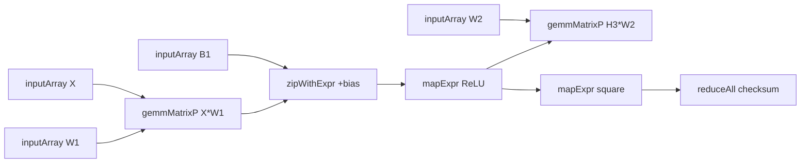

# Molten Example Suite Design

## Background

`molten` 目前已经具备四条可展示的主线能力：

1. `Program` 的 staged SSA / DAG 执行
2. shape-aware BLAS on `DeviceArray`
3. `rocFFT` / `rocRAND` 的独立 runtime
4. CPU reference evaluator for core array nodes + shape-aware BLAS

仓库当前只有 `app/Main.hs` 的基础 demo。它能证明最小 MVP 可用，但还不能承担两件更重要的工作：

- 向用户展示 `molten` 现在真正能做什么
- 对 library 做更有意义、更有压力的端到端验证

因此需要新增一组可运行 examples，把 BLAS、Program、FFT、RAND、CPU reference 这些能力组合成真实 mini-app，而不是再加更大的玩具向量 demo。

## Problem

需要同时满足四个目标：

1. examples 必须有真实数值 / ML / 科学 / 金融意义
2. examples 默认就要跑中到大规模 workload，足以给运行时和 GPU 路径施压
3. examples 不能只是 benchmark；必须包含 self-check，失败时非零退出
4. examples 必须贴合当前 API 边界，不依赖尚不存在的大量新特性

额外约束：

- 采用 **三个独立 executable**，不是单一 runner
- 默认模式为 **benchmark + self-check**
- 当前 CPU reference 只覆盖基础 array 节点与 shape-aware BLAS，不覆盖 FFT / RAND
- 当前 `Exp` EDSL 已有 `add` / `mul` / `cmp` / `select` / `cast`
- 为了让 FFT example 真正成立，需要补上 `Complex Float` / `Complex Double` 的 `NumericExp`

## Questions and Answers

### Q1. examples 采用什么包装方式？

**Answer:** 三个独立 executable：

- `molten-example-mlp-forward`
- `molten-example-heat2d-fft`
- `molten-example-monte-carlo-bachelier`

### Q2. 默认运行模式是什么？

**Answer:** 默认就是中到大规模 stress workload。

### Q3. 默认是否必须带 correctness check？

**Answer:** 必须。采用 benchmark + self-check，失败即非零退出。

### Q4. examples 是否只写在 `app/` 下？

**Answer:** 否。核心逻辑放进可测试的 library 模块，`app/*/Main.hs` 只负责 CLI 与调用。

### Q5. FFT example 是否需要额外能力补齐？

**Answer:** 需要。当前 `ArrayScalar` 已支持复数，但 `NumericExp` 尚未支持复数加乘。必须先补齐 `Complex Float` / `Complex Double` 的数值运算与 HIP 渲染，才能在频域做 pointwise multiplier。

## Design

### Overall Structure

新增以下 library modules：

- `src/Molten/Examples/Common.hs`
- `src/Molten/Examples/MlpForward.hs`
- `src/Molten/Examples/Heat2dFft.hs`
- `src/Molten/Examples/MonteCarloBachelier.hs`

新增以下 executables：

- `app/mlp-forward/Main.hs`
- `app/heat2d-fft/Main.hs`
- `app/monte-carlo-bachelier/Main.hs`

`Common` 提供共享能力：

- 参数默认值与简易 CLI 解析
- 计时 helper（基于 `GHC.Clock.getMonotonicTimeNSec`）
- 统一文本输出
- 浮点近似比较 helper
- 失败即退出的 assertion helper

examples 的计算逻辑放在 `src/Molten/Examples/*`，这样既能复用，也能直接被 Hspec 测试。

### Example 1: MLP Forward

目标：提供一个 deterministic、可 CPU-vs-GPU 对照、能覆盖 Program / BLAS / JIT array nodes / DAG 分支的 example。

计算流：



默认流程分两段：

1. 小 shadow case：同一份 `Program` 分别跑 `runProgramCpu` 与 GPU `runProgram`，逐项比较输出矩阵与 checksum
2. 大 stress case：GPU 路径运行默认大规模形状，输出 timing 与 summary

默认形状建议：

- shadow: `batch=64, in=128, hidden=256, out=64`
- stress: `batch=4096, in=1024, hidden=2048, out=512`

ReLU 使用 `select (x .<. 0) 0 x` 表达。

### Example 2: Heat2D FFT

目标：提供一个真实的谱方法 / FFT mini-app，重点覆盖 `FftRuntime`、复数 pointwise kernel、重复执行与 plan cache。

流程：

1. 在 host 侧构造二维实空间初值，再转成复数数组上传
2. 在 host 侧根据 `(kx, ky)` 预计算扩散方程的频域 multiplier：`1 - dt * alpha * (kx^2 + ky^2)`
3. 每步执行：
   - `fftForwardC2C`
   - `zipWithArray` 做频域 pointwise multiply
   - `fftInverseC2C`
4. 重复 `steps` 次
5. 读回结果并做 self-check

默认使用 eager runtime，而不是每步都重建 `Program`。原因：

- 热方程 stepper 的重点是重复执行与 runtime cache，不是 graph build
- eager `FFT + zipWithArray` 能更直接呈现 `FftRuntime` 和 `ArrayRuntime` 的协同

默认形状建议：

- `nx=1024, ny=1024, steps=100, alpha=0.05, dt=1e-3`
- 元素类型：`Complex Float`

self-check：

- 同样输入跑两次，结果必须近似一致
- `L2` 能量不得增长到超过允许容差
- kernel cache / FFT plan cache 在重复运行后应表现为复用而非无限增长（可作为 summary 打印）

### Example 3: Monte Carlo Bachelier

目标：提供一个真实的随机数 + payoff + reduction workload，重点覆盖 `RandRuntime`、Program 内 RAND 节点、大规模 reduction 与统计输出。

选用 Bachelier / normal model，而不是 Black-Scholes，原因是当前 EDSL 不依赖 `exp` / `log` 也能自然表达：

- `S_T = S0 + sigma * sqrtT * Z`
- `payoff = max(S_T - K, 0)`

Program 结构：

- `randNormalP`
- `mapExpr` 生成 terminal value
- `mapExpr` / `select` 生成 payoff
- `reduceAll` 得到 `sumPayoff`
- 分一条支路计算 `payoff^2` 再 `reduceAll` 得到 `sumSqPayoff`

默认参数建议：

- `paths=8_000_000`
- `seed=12345`
- `s0=100, strike=100, sigma=20, sqrtT=1`

self-check：

- 同 seed 重复两次，结果必须一致或在严格浮点容差内一致
- 价格必须非负
- 标准误差必须有限且非负
- 95% 置信区间必须包住估计值

### Shared Output Model

每个 executable 输出至少包含：

- example 名称
- 关键 problem size
- warmup 次数 / measured 次数
- wall-clock timing
- correctness summary
- 关键统计量

输出示例：

```text
Molten example: mlp-forward
Device: AMD Radeon ...
Stress shape: batch=4096 in=1024 hidden=2048 out=512
Shadow check: PASS (max abs err = 2.3e-5)
GPU run time: 184.2 ms
Checksum: 1.234567e8
```

## Implementation Plan

实现分四批：

1. 文档与共享 example infrastructure
2. `mlp-forward` + tests
3. 复数 `NumericExp` 支持 + `heat2d-fft` + tests
4. `monte-carlo-bachelier` + tests + README

每批遵循 TDD：先写失败测试，再补实现。

## Examples

### ✅ Good Example Shape

- `mlp-forward`：默认大矩阵 + 小 shadow 对照
- `heat2d-fft`：默认 `1024x1024x100`，可压 plan / kernel cache
- `monte-carlo-bachelier`：默认百万级路径，固定 seed，自带统计稳定性检查

### ❌ Bad Example Shape

- 仅 `saxpy` / `vector add`
- 只打印 timing，不检查结果
- 依赖当前没有的高级数学特性（如 softmax / exp）
- 只写在 `Main.hs` 里，无法测试

## Trade-offs

1. **为什么 example 逻辑放进 `src/` 而不是全写在 `app/`？**
   - 便于 Hspec 测试
   - 让 executable 保持薄层
   - 增加一点模块数，但换来可维护性

2. **为什么 heat stepper 不直接做 Program 版？**
   - 每步重建 graph 对这个例子的核心价值不大
   - eager runtime 更贴近 FFT + cache 的展示目标

3. **为什么 Monte Carlo 不做 Black-Scholes？**
   - 当前无需补 `exp` 即可实现真实金融 workload
   - 先把 RAND / reduction 路线做扎实，再考虑更复杂 payoff

4. **为什么 MLP 要带 shadow case？**
   - 默认 stress workload 很大，不适合作为唯一 correctness 证据
   - 小 shadow case 可以最大化利用已有 CPU reference evaluator

## Implementation Results

已完成：

- 新增 library modules：
  - `src/Molten/Examples/Common.hs`
  - `src/Molten/Examples/MlpForward.hs`
  - `src/Molten/Examples/Heat2dFft.hs`
  - `src/Molten/Examples/MonteCarloBachelier.hs`
- 新增 executables：
  - `app/mlp-forward/Main.hs`
  - `app/heat2d-fft/Main.hs`
  - `app/monte-carlo-bachelier/Main.hs`
- 新增 tests：
  - `test/Molten/Examples/CommonSpec.hs`
  - `test/Molten/Examples/MlpForwardSpec.hs`
  - `test/Molten/Examples/Heat2dFftSpec.hs`
  - `test/Molten/Examples/MonteCarloBachelierSpec.hs`
- 扩展复数 JIT 支持：
  - `src/Molten/Array/Expr.hs`
  - `src/Molten/Array/Runtime.hs`
  - `test/Molten/Array/ExprSpec.hs`
  - `test/Molten/Array/RuntimeSpec.hs`
- 更新：
  - `package.yaml`
  - `molten.cabal`
  - `README.md`
  - `test/Spec.hs`

实际实现与设计相比的主要细节：

1. `heat2d-fft` 的频域 multiplier 最终采用 **semi-implicit rational factor**：
   - `1 / (1 + dt * alpha * (kx^2 + ky^2))`
   - 同时把 `1 / (nx * ny)` 的 inverse FFT normalization 合入 multiplier
   - 这样在当前 unnormalized inverse FFT 语义下更稳定，也更容易保证能量不增长

2. `mlp-forward` 的 shadow check 最终区分了：
   - 输出矩阵：绝对误差容差
   - checksum：按 checksum 量级缩放的相对容差
   否则默认 stress executable 的 shadow check 会因 reduction 累积误差而误报失败。

3. examples 默认都采用 benchmark + self-check，失败即 `fail`，并打印 problem size 与关键统计量。

验证结果：

- `stack build`：通过
- `HSA_OVERRIDE_GFX_VERSION=11.0.0 stack test`：105 examples, 0 failures
- `HSA_OVERRIDE_GFX_VERSION=11.0.0 stack run molten-example-mlp-forward`：PASS
- `HSA_OVERRIDE_GFX_VERSION=11.0.0 stack run molten-example-heat2d-fft`：PASS
- `HSA_OVERRIDE_GFX_VERSION=11.0.0 stack run molten-example-monte-carlo-bachelier`：PASS
